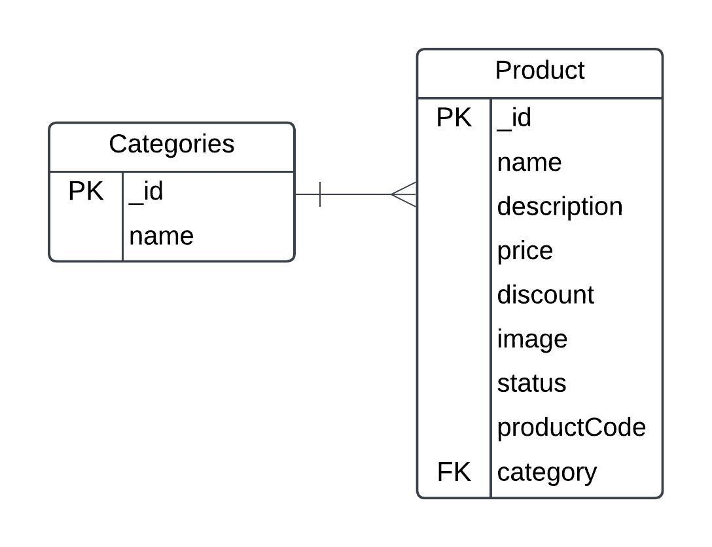

# **Product Management API**

A backend application for managing products and categories, built using **Node.js**, **Express.js**, and **MongoDB**. The API supports creating, updating, and retrieving products with advanced functionality such as unique product code generation, filtering, and category associations.

---

## **Features**

1. **Product Management**
   - Create products with attributes like name, description, price, discount, status, and image.
   - Auto-generate unique product codes based on product name.
   - Update product details (status, description, discount).

2. **Category Management**
   - Create and manage product categories.
   - Validate product-category associations.

3. **Product Filters**
   - Filter products by category.
   - Search for products by name (partial or full match).
   - Fetch original and discounted prices in responses.

4. **Unique Product Code Generation**
   - Product codes are generated using:
     - Longest strictly increasing substring from the product name.
     - Hash of the product name.
     - Start and end indices of the substring.

---

## **Getting Started**

### **Prerequisites**
Ensure you have the following installed:
- **Node.js** (v14+)
- **MongoDB**

---

### **Installation**

1. Clone the repository:
   ```bash
   git clone https://github.com/shihabshahrier/Backend-Development-Challenge.git
   cd 6sense-Backend-Development-Challenge.git
   ```

2. Install dependencies:
   ```bash
   npm install
   ```

3. Rename `.env.example` file to `.env` in the project root or do the followong command:
   ```bash
   cp .env.example .env
   ```

4. Start the development server:
   ```bash
   npm run dev
   ```

---

## **Endpoints**

### **Product Endpoints**
| Method | Endpoint                   | Description                          |
|--------|----------------------------|--------------------------------------|
| POST   | `/api/products`            | Create a new product                |
| PUT    | `/api/products/:productId` | Update product details              |
| GET    | `/api/products`            | Retrieve products with filters      |

**Filters for GET `/api/products`:**
- **`categoryId`**: Filter by category.
- **`search`**: Search by product name (partial match).
- **`priceMin` and `priceMax`**: Filter by price range.

---

### **Category Endpoints**
| Method | Endpoint                   | Description                |
|--------|----------------------------|----------------------------|
| POST   | `/api/categories`          | Create a new category      |

---

## **Data Models**

### **Product**
| Field       | Type      | Description                            |
|-------------|-----------|----------------------------------------|
| `name`      | `String`  | Name of the product                   |
| `description` | `String`  | Brief description of the product      |
| `price`     | `Number`  | Price of the product                  |
| `discount`  | `Number`  | Discount percentage (default: 0)      |
| `image`     | `String`  | Image URL of the product              |
| `status`    | `String`  | Stock status (In Stock / Stock Out)   |
| `productCode` | `String`  | Auto-generated unique product code    |
| `category`  | `ObjectId`| Reference to the associated category  |

### **Category**
| Field   | Type     | Description                |
|---------|----------|----------------------------|
| `name`  | `String` | Name of the category       |

---

## **Unique Product Code Logic**

1. **Hash** the product name using MD5 (first 8 characters).
2. Extract the **longest strictly increasing substring** (e.g., "abc" in "alphabeta").
3. Append the **start and end indices** of the substring in the product name.
4. Format: `<hashed_name>-<start_index><substring><end_index>`

**Example**:
For a product named **"Alpha Sorter"**:
- Longest substrings: **"alp"** and **"ort"**.
- Hash: **`p48asd4`**.
- Final product code: **`p48asd4-0alport8`**.

---

## **Database Design**

The database consists of two main entities: **Categories** and **Products**.

- **Categories**:
  - Each category has a unique `_id` and a `name`.
  - Example: Electronics, Fashion, Home Appliances.

- **Products**:
  - Each product belongs to one category and contains fields such as `name`, `description`, `price`, `discount`, `image`, `status`, and `productCode`.


### **Entity Relationship Diagram (ERD)**

Below is the ERD (Entity-Relationship Diagram) representing the database design:



---

## **Usage Examples**

### **1. Create a Product**
**POST** `/api/products`
```json
{
  "name": "Alpha Sorter",
  "description": "A great sorting tool",
  "price": 100,
  "discount": 10,
  "image": "http://example.com/image.jpg",
  "status": "In Stock",
  "categoryId": "63d5f708b25b5a4fc08a9c72"
}
```

Response:
```json
{
  "_id": "63d5f77c4e0a8300a9e8bf1b",
  "name": "Alpha Sorter",
  "description": "A great sorting tool",
  "price": 100,
  "discount": 10,
  "image": "http://example.com/image.jpg",
  "status": "In Stock",
  "productCode": "p48asd4-0alport8",
  "category": "63d5f708b25b5a4fc08a9c72"
}
```

### **2. Retrieve Products**
**GET** `/api/products?categoryId=63d5f708b25b5a4fc08a9c72&search=Alpha`

Response:
```json
[
  {
    "_id": "63d5f77c4e0a8300a9e8bf1b",
    "name": "Alpha Sorter",
    "description": "A great sorting tool",
    "price": 100,
    "discount": 10,
    "image": "http://example.com/image.jpg",
    "status": "In Stock",
    "productCode": "p48asd4-0alport8",
    "finalPrice": 90
  }
]
```

---


